# Technical Reference (Professional)

This document provides an in‑depth, professional reference including:
- API endpoints with request/response examples
- Per‑function notes for backend controllers
- Database schema diagram (Mermaid ERD)

---

## 1) API Reference (REST)

**Base URL:** `http://localhost:3000`

### Users
- **GET** `/api/users`
  - Lists all users.
- **GET** `/api/users/:id`
  - Fetch a single user.
- **POST** `/api/users`
  - Create a user.
- **PUT** `/api/users/:id`
  - Update a user.
- **DELETE** `/api/users/:id`
  - Delete a user.

**Example: Create User**
```http
POST /api/users
Content-Type: application/json

{
  "name": "Alice",
  "email": "alice@rvce.edu",
  "password": "secret"
}
```

---

### Products
- **GET** `/api/products`
  - List products. Supports query params: `category`, `sellerid`, `status`, `q`.
- **GET** `/api/products/search`
  - Search products by filters.
- **GET** `/api/products/:id`
  - Get product details.
- **POST** `/api/products`
  - Create listing.
- **PUT** `/api/products/:id`
  - Update listing.
- **DELETE** `/api/products/:id`
  - Delete listing (blocked if transactions exist).

**Reservation Flow**
- **POST** `/api/products/:id/reserve`
  - Reserve product (buyer action)
- **POST** `/api/products/:id/confirm-meet`
  - Confirm meeting and generate OTP (buyer action)
- **POST** `/api/products/:id/cancel`
  - Cancel reservation with grace-count tracking and trust penalty (buyer/seller action, pre-OTP only)
- **POST** `/api/products/:id/dispute`
  - Create dispute after OTP generated (buyer action, post-OTP alternative to cancel)
- **POST** `/api/products/:id/reschedule`
  - Request reschedule (buyer/seller action)
- **POST** `/api/products/:id/reschedule/reject`
  - Reject reschedule request (seller action)

**Example: Create Product**
```http
POST /api/products
Content-Type: application/json

{
  "pname": "Calculator",
  "category": "Electronics",
  "price": 500,
  "status": "available",
  "bought_year": 2023,
  "preferred_for": "all",
  "no_of_copies": 1,
  "image_url": "http://localhost:3000/images/calc.png",
  "sellerid": 1
}
```

---

### Product Specs
- **GET** `/api/product-specs?pid=1`
- **POST** `/api/product-specs`
- **DELETE** `/api/product-specs/:pid/:spec_name`

**Example: Create Spec**
```http
POST /api/product-specs
Content-Type: application/json

{ "pid": 1, "spec_name": "Brand", "spec_value": "Casio" }
```

---

### Product Images
- **GET** `/api/images?pid=1`
- **POST** `/api/images`
- **DELETE** `/api/images/:pid/:img_url`

---

### Wishlist
- **GET** `/api/wishlist?uid=1`
- **POST** `/api/wishlist`
- **DELETE** `/api/wishlist/:uid/:pid`

---

### Admin (New)
- **POST** `/api/admin/login`
  - Admin authentication (separate from student users, JWT issued)
- **POST** `/api/admin/logout`
  - Admin logout (client-side token removal)
- **GET** `/api/admin/me`
  - Get current admin profile
- **GET** `/api/admin/products/pending`
  - Products awaiting verification
- **GET** `/api/admin/products/flagged`
  - Auto-flagged products
- **POST** `/api/admin/products/:id/approve`
  - Approve pending product
- **POST** `/api/admin/products/:id/reject`
  - Reject pending product (body: { reason })
- **POST** `/api/admin/products/:id/flag`
  - Flag product (body: { reason })
- **GET** `/api/admin/products/history`
  - Verification history with filters
- **GET** `/api/admin/users`
  - List users with filters (suspended, trust score)
- **GET** `/api/admin/users/:id`
  - Full user profile + transactions
- **POST** `/api/admin/users/:id/suspend`
  - Suspend user (super_admin only)
- **POST** `/api/admin/users/:id/unsuspend`
  - Lift suspension (super_admin only)
- **GET** `/api/admin/users/:id/activity`
  - Recent listings, purchases, sales
- **GET** `/api/admin/analytics/overview`
  - Platform overview metrics
- **GET** `/api/admin/analytics/trends?start=YYYY-MM-DD&end=YYYY-MM-DD`
  - Daily trends for users/products/transactions
- **GET** `/api/admin/analytics/categories`
  - Category breakdown with revenue
- **GET** `/api/admin/analytics/locations`
  - Popular meeting locations
- **GET** `/api/admin/analytics/trust-distribution`
  - Trust score histogram
- **GET** `/api/admin/analytics/abandonment`
  - Funnel analysis (created → reserved → location → OTP → sold)
- **GET** `/api/admin/analytics/peak-times`
  - Transactions by hour/day
- **GET** `/api/admin/reports/transactions?start=YYYY-MM-DD&end=YYYY-MM-DD`
  - CSV export (super_admin only)
- **GET** `/api/admin/reports/users`
  - CSV export (super_admin only)
- **GET** `/api/admin/reports/flagged-activity`
  - Suspicious patterns report

**Admin Auth Requirements**
- `Authorization: Bearer <admin_token>` for all admin endpoints except `/login`.
- Secret key: `ADMIN_JWT_SECRET` (separate from student JWT).

**Admin Auth Troubleshooting**
- If `/api/admin/login` returns `Invalid credentials`, verify the stored bcrypt hash is valid (60 chars, `$2b$10$` prefix).
- Placeholder hashes from admin_migration sample data will always fail; re-run `database/admin_test_data.sql` to upsert valid hashes for Admin@123.
- For debugging, the backend logs failed login attempts with email, IP, and failure reason (passwords are never logged).

**Example: Verify Product**
```http
POST /api/admin/products/123/approve
Content-Type: application/json
Authorization: Bearer <admin_token>
```

---

### Transactions
- **GET** `/api/transactions`
- **POST** `/api/transactions`
- **GET** `/api/transactions/my-purchases` (auth)

---

### Locations
- **POST** `/api/locations/:pid` (seller proposes)
- **GET** `/api/locations/:pid`
- **POST** `/api/locations/:pid/select` (buyer selects)

---

### OTP
- **POST** `/api/otp/verify`

---

### Gamification
- **GET** `/api/gamification/me`
  - Current user's gamification stats with dynamically resolved badges
- **GET** `/api/gamification/user/:uid`
  - Gamification stats for specific user
- **POST** `/api/gamification/track-login`
  - Track login for trust points
- **GET** `/api/gamification/leaderboard?limit=10`
  - Top users by trust score
- **GET** `/api/gamification/badges`
  - Complete badge catalog with criteria and category labels
- **POST** `/api/gamification/ratings`
  - Create rating after transaction
- **GET** `/api/gamification/ratings/:pid`
  - Get ratings for product

**Dynamic Badge System**
- Badges are computed in real-time from transaction data (no user_badges table writes)
- Badge resolution queries: completedSales, completedPurchases, preOtpCancels90, disputes90
- Trust penalty: -5 points after exceeding GRACE_CANCELLATIONS (2 free cancellations in 90 days)

---

## 2) Backend Controller Function Notes

### usersController.js
- `listUsers()` → returns all users.
- `getUserById()` → fetches user by ID.
- `createUser()` → inserts a user with hashed pass with grace-count tracking and trust penalty.
  - Tracks cancellations in `reservation_cancellations` table with is_pre_otp flag
  - Blocks cancellation if status is 'otp_generated' (redirects to dispute flow)
  - Counts recent pre-OTP cancellations (90-day window)
  - Applies -5 trust penalty after exceeding GRACE_CANCELLATIONS (2)
- `createDispute()` → creates dispute record for post-OTP issues.
  - Required fields: product_id, reason
  - Status enum: 'pending', 'resolved', 'escalated'
  - Blocks cancel button in BuyerOTPDisplay componentord.
- `updateUser()` → updates user profile fields.
- `deleteUser()` → removes user.

### productsController.js
- `listProducts()` → list products with seller + image join.
- `searchProducts()` → filtered search by category/price.
- `getProductById()` → returns full product record.
- `createProduct()` → inserts into products + product_seller + optional image.
- `updateProduct()` → updates editable product fields.
- `deleteProduct()` → removes product if no transactions exist.
- `reserveProduct()` → buyer reserves product (status + reserved_by).
- `confirmMeet()` → buyer confirms meet (requires location selection).
- `cancelReservation()` → resets reservation state.
- `rescheduleProduct()` → handles reschedule workflow.
- `rejectReschedule()` → cancels reschedule request and restores status.

### productSpecsController.js
- `listProductSpecs()` → list specs by product.
- `createProductSpec()` → add spec name/value.
- `deleteProductSpec()` → remove spec.

### productSellersController.js
- `listProductSellers()` → list seller mappings.
- `upsertProductSeller()` → assign seller to product.
- `deleteProductSeller()` → remove seller mapping.

### productLocationsController.js
- `listProductLocations()` → list locations for a product.
- `createProductLocation()` → add a location row.
- `deleteProductLocation()` → remove location row.

### locationController.js
- `createLocations()` → seller proposes multiple locations.
- `getLocations()` → fetch proposed locations.
- `selectLocation()` → buyer selects one location.

### otpController.js
- `verifyOTP()` → verify OTP, complete transaction, mark sold.

### transactionsController.js
- `listTransactions()` → list transactions with filters.
- `createTransaction()` → insert new transaction record.
- `listMyPurchases()` → list purchases for curren with dynamic badges.
- `getUserGamification()` → gamification stats for user ID with dynamic badges.
- `trackLogin()` → updates trust points for logins.
- `leaderboard()` → returns top users.
- `getBadgesCatalog()` → returns complete badge catalog from BADGE_CATALOG.
  - Categories: Seller Achievements, Buyer Achievements, Transaction Milestones
  - Each badge includes: badgeId, name, description, criteria, category
- `createRating()` → add rating after transaction.
- `getRatingForProduct()` → fetch rating for product.

**Note:** Uses `resolveDynamicBadges()` from gamificationService instead of querying user_badges table

### gamificationController.js
- `getMe()` → gamification stats for current user.
- `getUserGamification()` → gamification stats for user ID.
- `trackLogin()` → updates trust points for logins.
- `leaderboard()` → returns top users.
- `createRating()` → add rating after transaction.
- `getRatingForProduct()` → fetch rating for product.

### chatsController.js
- `listChats()` → list chats (Mongo optional).
- `createChat()` → create chat message.

### categoriesController.js
- `listCategories()` → list categories.
- `createCategory()` → add category.
- `updateCategory()` → update category.
- `deleteCategory()` → delete category.

### ordersController.js
- `listOrders()` → list orders.
- `getOrderById()` → get order.
- `createOrder()` → create order.
- `deleteOrder()` → delete order.

### adminAuthController.js
- `adminLogin()` → authenticate admin users, return JWT.
- `adminLogout()` → invalidate session client-side.
- `getAdminProfile()` → returns current admin profile.

### adminProductsController.js
- `getPendingProducts()` → list pending verifications (auto-flag rules applied).
- `getFlaggedProducts()` → list flagged products.
- `approveProduct()` → approve pending product.
- `rejectProduct()` → reject pending product.
- `flagProduct()` → flag product (manual).
- `getVerificationHistory()` → verification history with filters.

### adminUsersController.js
- `listUsersAdmin()` → list users with filters (suspended, trust range).
- `getUserProfileAdmin()` → profile + transactions.
- `suspendUser()` → suspend user (super_admin only).
- `unsuspendUser()` → lift suspension.
- `getUserActivity()` → recent listings, purchases, sales.

### adminAnalyticsController.js
- `getOverview()` → platform totals and pending verifications.
- `getTrends()` → daily trend breakdown.
- `getCategoryBreakdown()` → category metrics.
- `getLocationStats()` → meeting location frequency.
- `getTrustDistribution()` → trust score histogram.
- `getAbandonmentFunnel()` → funnel analysis.
- `getPeakTimes()` → peak transaction times.

### adminReportsController.js
- `exportTransactionsReport()` → CSV export for transactions.
- `exportUsersReport()` → CSV export for users.
- `getFlaggedActivityReport()` → suspicious patterns summary.

---

## 3) Database Schema Diagram (Mermaid ERD)

```mermaid
erDiagram
  users ||--o{ product_seller : sells
  users ||--o{ add_to_wishlist : wishes
  users ||--o{ transaction : buys
  users ||--o{ user_badges : earns
  users ||--o{ user_ratings : rates
  users ||--o{ user_suspensions : suspended

  products ||--o{ product_seller : has
  products ||--o{ prod_spec : has
  products ||--o{ prod_img : has
  products ||--o{ prod_loc : has
  products ||--o{ transaction : sold_in
  products ||--o{ otp_tokens : uses
  products ||--o{ proposed_locations : proposes
  products ||--o{ reschedule_requests : reschedules
  products ||--o{ user_ratings : rated
  products ||--|| product_verification : verified_by
  products ||--o{ reservation_cancellations : tracks
  products ||--o{ disputes : disputes

  badges ||--o{ user_badges : maps

  admin_users ||--o{ product_verification : verifies
  admin_users ||--o{ admin_actions_log : performs
  admin_users ||--o{ user_suspensions : suspends
  admin_users ||--o{ user_suspensions : lifts

  users ||--o{ reservation_cancellations : cancels
  users ||--o{ disputes : raises

  users {
    int uid PK
    string name
    string email
    string password
    enum role
    int trust_points
  }

  admin_users {
    int admin_id PK
    string email UK
    string password_hash
    string full_name
    enum role
    boolean is_active
    timestamp created_at
    timestamp last_login
  }

  product_verification {
    int verification_id PK
    int product_id FK
    enum status
    int verified_by FK
    timestamp verified_at
    string rejection_reason
    text admin_notes
    text flag_details
  }

  admin_actions_log {
    bigint action_id PK
    int admin_id FK
    enum action_type
    enum target_type
    int target_id
    text details
    string ip_address
    timestamp timestamp
  }

  user_suspensions {
    int suspension_id PK
    int user_id FK
    int suspended_by FK
    string reason
    timestamp suspended_at
    timestamp suspended_until
    boolean is_active
    int lifted_by FK
  }

  daily_stats {
    date stat_date PK
    int total_users
    int new_users_today
    int total_products
    int pending_verifications
    int active_suspensions
    decimal total_revenue_today
  }

  category_stats {
    string category PK
    int product_count
    decimal avg_price
    int total_wishlist_adds
  }

  reservation_cancellations {
    int id PK
    int product_id FK
    int cancelled_by FK
    boolean is_pre_otp
    string stage
    timestamp cancelled_at
  }

  disputes {
    int id PK
    int product_id FK
    int raised_by FK
    text reason
    enum status
    string evidence_url
    timestamp created_at
  }
```



---

## 4) Interview‑Grade Examples (API)

### Reserve → Location → OTP Sequence (buyer + seller)

1) **Buyer reserves**
```http
POST /api/products/12/reserve
Authorization: Bearer <token>
```

2) **Seller proposes locations**
```http
POST /api/locations/12
Content-Type: application/json

{
  "sellerid": 1,
  "locations": [
    { "location": "Kriyakalpa", "time": "10:30" },
    { "location": "Mingos", "time": "12:00" }
  ]
}
```

3) **Buyer selects location**
```http
POST /api/locations/12/select
Content-Type: application/json

{ "buyerid": 2, "location": "Mingos" }
```

4) **Buyer generates OTP**
```http
POST /api/products/12/confirm-meet
Authorization: Bearer <token>
```

5) **Seller verifies OTP**
```http
POST /api/otp/verify
Content-Type: application/json

{ "product_id": 12, "otp": "123456" }
```

### Cancellation with Grace-Count Penalty (Pre-OTP)

**Scenario:** Buyer cancels reservation before OTP generation

```http
POST /api/products/12/cancel
Authorization: Bearer <token>
Content-Type: application/json

{ "reason": "Changed my mind" }
```

**Backend Logic:**
```javascript
// Check if OTP already generated (blocks cancellation)
if (product.status === 'otp_generated') {
  return res.status(400).json({ 
    error: 'Cannot cancel after OTP generated. Please use dispute flow.' 
  });
}

// Track cancellation
await pool.query(
  `INSERT INTO reservation_cancellations 
   (product_id, cancelled_by, is_pre_otp, stage) 
   VALUES (?, ?, TRUE, ?)`,
  [productId, userId, product.status]
);

// Count recent cancellations (90-day window)
const [cancelCounts] = await pool.query(
  `SELECT COUNT(*) as count FROM reservation_cancellations 
   WHERE cancelled_by = ? AND is_pre_otp = TRUE 
   AND cancelled_at > DATE_SUB(NOW(), INTERVAL 90 DAY)`,
  [userId]
);

// Apply penalty after grace count
const GRACE_CANCELLATIONS = 2;
if (cancelCounts[0].count >= GRACE_CANCELLATIONS) {
  await gamificationService.addTrustPoints(
    userId,
    gamificationService.TRUST_POINTS.RESERVATION_CANCEL_PENALTY // -5
  );
}
```

**Response:**
```json
{
  "message": "Reservation cancelled",
  "penaltyApplied": true,
  "trustPointsDeducted": 5,
  "totalCancellations": 3,
  "graceRemaining": 0
}
```

### Dispute Flow (Post-OTP)

**Scenario:** Buyer needs to cancel after OTP generated

```http
POST /api/products/12/dispute
Authorization: Bearer <token>
Content-Type: application/json

{
  "reason": "Seller didn't show up at meeting location",
  "evidence_url": "https://example.com/evidence.jpg"
}
```

**Backend Logic:**
```javascript
// Validate OTP is generated
const [product] = await pool.query(
  `SELECT * FROM products WHERE pid = ?`,
  [productId]
);

if (product.status !== 'otp_generated') {
  return res.status(400).json({ 
    error: 'Disputes can only be raised after OTP generation' 
  });
}

// Create dispute
await pool.query(
  `INSERT INTO disputes 
   (product_id, raised_by, reason, evidence_url, status) 
   VALUES (?, ?, ?, ?, 'pending')`,
  [productId, userId, reason, evidenceUrl]
);
```

**Response:**
```json
{
  "success": true,
  "disputeId": 42,
  "status": "pending",
  "message": "Dispute created. Admin will review within 24 hours."
}
```

**Frontend (BuyerOTPDisplay.jsx):**
```jsx
{product.status === 'otp_generated' ? (
  <button onClick={handleDispute} className="btn btn--danger">
    Raise Dispute
  </button>
) : (
  <button onClick={handleCancel} className="btn btn--secondary">
    Cancel Reservation
  </button>
)}
```

### Dynamic Badge Resolution

**Get User Gamification Stats:**
```http
GET /api/gamification/user/42
Authorization: Bearer <token>
```

**Backend Logic:**
```javascript
async function resolveDynamicBadges(uid) {
  // Query real-time transaction data
  const [completedSales] = await pool.query(
    `SELECT COUNT(*) as count FROM transactions WHERE sellerid = ?`,
    [uid]
  );
  
  const [completedPurchases] = await pool.query(
    `SELECT COUNT(*) as count FROM transactions WHERE buyerid = ?`,
    [uid]
  );
  
  const [preOtpCancels] = await pool.query(
    `SELECT COUNT(*) as count FROM reservation_cancellations 
     WHERE cancelled_by = ? AND is_pre_otp = TRUE 
     AND cancelled_at > DATE_SUB(NOW(), INTERVAL 90 DAY)`,
    [uid]
  );
  
  const [disputes] = await pool.query(
    `SELECT COUNT(*) as count FROM disputes 
     WHERE raised_by = ? 
     AND created_at > DATE_SUB(NOW(), INTERVAL 90 DAY)`,
    [uid]
  );

  // Resolve badges based on criteria
  const badges = [];
  
  // Seller badges
  if (completedSales[0].count >= 1) badges.push('first_sale');
  if (completedSales[0].count >= 5) badges.push('trusted_seller');
  if (completedSales[0].count >= 20) badges.push('power_seller');
  
  // Buyer badges
  if (completedPurchases[0].count >= 1) badges.push('first_purchase');
  if (completedPurchases[0].count >= 5) badges.push('savvy_shopper');
  
  // Transaction milestones
  const totalTransactions = completedSales[0].count + completedPurchases[0].count;
  if (totalTransactions >= 10) badges.push('marketplace_regular');
  if (totalTransactions >= 50) badges.push('campus_trader');
  
  // Reliability badges
  if (preOtpCancels[0].count === 0 && completedSales[0].count >= 5) {
    badges.push('reliable');
  }
  
  if (disputes[0].count === 0 && totalTransactions >= 10) {
    badges.push('dispute_free');
  }

  return badges;
}
```

**Response:**
```json
{
  "user": {
    "uid": 42,
    "name": "Alice",
    "email": "alice@rvce.edu.in",
    "trust_points": 85
  },
  "badges": [
    "first_sale",
    "trusted_seller",
    "first_purchase",
    "savvy_shopper",
    "marketplace_regular",
    "reliable"
  ],
  "stats": {
    "completedSales": 7,
    "completedPurchases": 3,
    "totalTransactions": 10,
    "recentCancellations": 0,
    "recentDisputes": 0
  }
}
```

### Badge Catalog with Lock States

**Get Badge Catalog:**
```http
GET /api/gamification/badges
Authorization: Bearer <token>
```

**Response:**
```json
{
  "badges": [
    {
      "badgeId": "first_sale",
      "name": "First Sale",
      "description": "Completed your first transaction as a seller",
      "criteria": "Complete 1 sale",
      "category": "Seller Achievements"
    },
    {
      "badgeId": "trusted_seller",
      "name": "Trusted Seller",
      "description": "Proven track record with multiple sales",
      "criteria": "Complete 5 sales",
      "category": "Seller Achievements"
    },
    {
      "badgeId": "power_seller",
      "name": "Power Seller",
      "description": "Elite seller status with high volume",
      "criteria": "Complete 20 sales",
      "category": "Seller Achievements"
    }
  ]
}
```

**Frontend Rendering (Community.jsx):**
```jsx
{badgeCatalog.map(badge => {
  const isOwned = userBadges.includes(badge.badgeId);
  return (
    <div 
      key={badge.badgeId} 
      className={`badge-item ${isOwned ? '' : 'badge-item--locked'}`}
    >
      <div className="badge-item__icon">
        {isOwned ? '🏆' : '🔒'}
      </div>
      <div className="badge-item__info">
        <div className="badge-item__name">{badge.name}</div>
        <div className="badge-item__desc">{badge.description}</div>
        <div className="badge-item__criteria">
          {isOwned ? '✓ Unlocked' : `Unlock by: ${badge.criteria}`}
        </div>
      </div>
    </div>
  );
})}
```

**CSS Styling:**
```css
.badge-item--locked {
  filter: grayscale(1);
  opacity: 0.55;
  cursor: not-allowed;
}
```

### Notification Dots with Polling

**Frontend Implementation (Navbar.jsx):**
```jsx
const [sellerAlertCount, setSellerAlertCount] = useState(0);
const [buyerAlertCount, setBuyerAlertCount] = useState(0);

useEffect(() => {
  const loadAlerts = async () => {
    if (!user) return;
    
    const products = await fetchProducts();
    
    // Count seller's in-progress reservations
    const sellerInProgress = products.filter(p => 
      p.sellerid === user.uid && 
      ['reserved', 'location_proposed', 'location_selected', 'otp_generated'].includes(p.status)
    );
    setSellerAlertCount(sellerInProgress.length);
    
    // Count buyer's in-progress reservations
    const buyerInProgress = products.filter(p => 
      p.reserved_by === user.uid && 
      ['reserved', 'location_proposed', 'location_selected', 'otp_generated'].includes(p.status)
    );
    setBuyerAlertCount(buyerInProgress.length);
  };
  
  loadAlerts();
  const interval = setInterval(loadAlerts, 30000); // Poll every 30s
  return () => clearInterval(interval);
}, [user]);

// Render notification dots
<NavLink to="/" className="navbar__link">
  Home
  {buyerAlertCount > 0 && <span className="nav-dot nav-dot--corner" />}
</NavLink>

<NavLink to="/?view=sell" className="navbar__link">
  Dashboard
  {sellerAlertCount > 0 && <span className="nav-dot nav-dot--corner" />}
</NavLink>
```

**CSS Positioning:**
```css
.navbar__link,
.tab,
.ghost {
  position: relative; /* Required for absolute positioning of dot */
}

.nav-dot {
  width: 8px;
  height: 8px;
  background-color: #ef4444; /* Red */
  border-radius: 50%;
}

.nav-dot--corner {
  position: absolute;
  top: 4px;
  right: 6px;
}
```

### Image Fallback Strategy

**Frontend Implementation (ProductCard.jsx):**
```jsx
import { useState } from 'react';
import productPlaceholder from '../assets/product-placeholder.svg';
import { resolveImageUrl } from '../utils/imageUtils';

function ProductCard({ product }) {
  const [imgSrc, setImgSrc] = useState(resolveImageUrl(product.image_url));

  return (
    <div className="product-card">
       setImgSrc(productPlaceholder)}
      />
      {/* ... rest of card */}
    </div>
  );
}
```

**Local Placeholder (product-placeholder.svg):**
```svg
<svg xmlns="http://www.w3.org/2000/svg" viewBox="0 0 400 300">
  <rect width="400" height="300" fill="#e5e7eb"/>
  <text x="200" y="150" font-size="24" text-anchor="middle" fill="#9ca3af">
    No Image
  </text>
  <circle cx="200" cy="110" r="30" fill="#d1d5db"/>
  <path d="M 170 190 Q 200 170 230 190" stroke="#d1d5db" fill="none" stroke-width="4"/>
</svg>
```

**Benefits:**
- No external dependency (eliminates DNS/network failures)
- Consistent fallback across all views (ProductCard, ProductDetails, SellerDashboard, Admin)
- Graceful degradation with onError handler
- SVG scales cleanly at any resolution

---

## 5) Where to Add New Features
- **New API** → add route in `backend/src/routes`, handler in `backend/src/controllers`, and SQL migration if needed.
- **New UI page** → add page in `frontend/src/pages` and route in `frontend/src/App.jsx`.
- **New workflow** → update controller + status transitions in `productsController.js`, then mirror UI in `ProductDetails.jsx` or `SellerDashboard.jsx`.

---

## 6) Troubleshooting Guide

### Trust Penalty Not Applied

**Symptoms:**
- User cancels reservation multiple times but trust score doesn't decrease
- `cancelCounts[0].count` always returns 0

**Solutions:**
1. Verify `reservation_cancellations` table exists:
```sql
SHOW TABLES LIKE 'reservation_cancellations';
```

2. Check if cancellations are being tracked:
```sql
SELECT * FROM reservation_cancellations 
WHERE cancelled_by = ? 
ORDER BY cancelled_at DESC;
```

3. Verify GRACE_CANCELLATIONS constant in `productsController.js`:
```javascript
const GRACE_CANCELLATIONS = 2;
```

4. Check 90-day window query:
```sql
SELECT COUNT(*) as count FROM reservation_cancellations 
WHERE cancelled_by = ? AND is_pre_otp = TRUE 
AND cancelled_at > DATE_SUB(NOW(), INTERVAL 90 DAY);
```

### Badges Not Showing / Always Locked

**Symptoms:**
- All badges appear locked in Community page
- `resolveDynamicBadges()` returns empty array

**Solutions:**
1. Verify gamificationService is using dynamic resolver:
```javascript
// In gamificationController.js
const badges = await gamificationService.resolveDynamicBadges(uid);
```

2. Check transaction data exists:
```sql
SELECT COUNT(*) FROM transactions WHERE sellerid = ? OR buyerid = ?;
```

3. Verify BADGE_CATALOG is imported correctly:
```javascript
// In gamificationService.js
const BADGE_CATALOG = [
  {
    badgeId: 'first_sale',
    name: 'First Sale',
    // ...
  }
];
```

4. Test badge resolution directly:
```javascript
const badges = await resolveDynamicBadges(userId);
console.log('Resolved badges:', badges);
```

### Notification Dots Not Appearing

**Symptoms:**
- Red dots don't show on navbar even with pending reservations
- `sellerAlertCount` / `buyerAlertCount` always 0

**Solutions:**
1. Verify polling is running:
```javascript
useEffect(() => {
  console.log('Loading alerts...', user);
  loadAlerts();
  const interval = setInterval(loadAlerts, 30000);
  return () => clearInterval(interval);
}, [user]);
```

2. Check product status filtering:
```javascript
const sellerInProgress = products.filter(p => {
  console.log('Product:', p.pid, 'Status:', p.status, 'Seller:', p.sellerid);
  return p.sellerid === user?.uid && 
    ['reserved', 'location_proposed', 'location_selected', 'otp_generated'].includes(p.status);
});
```

3. Verify CSS positioning:
```css
.navbar__link { position: relative; }
.nav-dot--corner { 
  position: absolute;
  top: 4px;
  right: 6px;
}
```

4. Check user authentication:
```javascript
console.log('Current user:', user);
```

### Image Fallback Not Working

**Symptoms:**
- Broken image icons appear
- onError handler not triggered
- Images don't fallback to placeholder

**Solutions:**
1. Verify local placeholder exists:
```bash
ls frontend/src/assets/product-placeholder.svg
```

2. Check import statement:
```javascript
import productPlaceholder from '../assets/product-placeholder.svg';
```

3. Verify useState initialization:
```javascript
const [imgSrc, setImgSrc] = useState(resolveImageUrl(product.image_url));
```

4. Test onError handler:
```javascript
 {
    console.log('Image error:', e.target.src);
    setImgSrc(productPlaceholder);
  }}
/>
```

### Dispute Flow Not Accessible

**Symptoms:**
- Cancel button still appears after OTP generation
- Dispute button doesn't show

**Solutions:**
1. Verify product status check in frontend:
```javascript
{product.status === 'otp_generated' ? (
  <button onClick={handleDispute}>Raise Dispute</button>
) : (
  <button onClick={handleCancel}>Cancel Reservation</button>
)}
```

2. Check backend validation:
```javascript
if (product.status === 'otp_generated') {
  return res.status(400).json({ 
    error: 'Cannot cancel after OTP generated' 
  });
}
```

3. Verify disputes table exists:
```sql
SHOW TABLES LIKE 'disputes';
```

4. Check createDispute API endpoint:
```http
POST /api/products/:id/dispute
Authorization: Bearer <token>
Content-Type: application/json

{ "reason": "Test dispute" }
```

### Navbar Active State Not Highlighting

**Symptoms:**
- Active page not highlighted in navbar
- All navbar links have same styling

**Solutions:**
1. Verify NavLink component usage:
```javascript
import { NavLink } from 'react-router-dom';

<NavLink to="/" className="navbar__link">
  Home
</NavLink>
```

2. Check CSS for .active class:
```css
.navbar__link.active {
  background-color: var(--rvce-gold);
  color: var(--rvce-navy);
}
```

3. For query-based routing (?view=sell):
```javascript
const isActive = view === 'sell';
<Link className={`navbar__link ${isActive ? 'active' : ''}`}>
  Dashboard
</Link>
```

### Stale Transaction Messages Persist

**Symptoms:**
- "Waiting for seller to propose locations" shows after transaction sold
- Status messages don't clear

**Solutions:**
1. Add useEffect to clear messages:
```javascript
useEffect(() => {
  if (product.status !== 'reserved' || !product.reschedule_requested_by) {
    setStatus(prev => ({ ...prev, message: '' }));
  }
}, [product.status, product.reschedule_requested_by]);
```

2. Verify status conditions:
```javascript
if (product.status === 'sold') {
  setStatus({ type: 'success', message: '' });
}
```

3. Check backend product updates clear fields:
```sql
UPDATE products 
SET status = 'sold', 
    reserved_by = NULL,
    reschedule_requested_by = NULL,
    selected_location = NULL
WHERE pid = ?;
```

### Database Migration Errors

**Symptoms:**
- "Table already exists" errors
- Foreign key constraint failures

**Solutions:**
1. Use idempotent migrations:
```sql
CREATE TABLE IF NOT EXISTS reservation_cancellations (
  -- columns
);

DROP INDEX IF EXISTS idx_cancellations_user ON reservation_cancellations;
CREATE INDEX idx_cancellations_user ON reservation_cancellations(cancelled_by);
```

2. Check migration order (run in sequence):
```
1. schema.sql
2. seed.sql
3. otp_tokens_migration.sql
4. gamification_migration.sql
5. admin_migration.sql
6. reservation_dispute_migration.sql
```

3. Verify foreign key references exist:
```sql
SELECT TABLE_NAME 
FROM INFORMATION_SCHEMA.TABLES 
WHERE TABLE_NAME IN ('products', 'users');
```

4. For constraint errors, drop and recreate:
```sql
ALTER TABLE reservation_cancellations DROP FOREIGN KEY fk_product;
ALTER TABLE reservation_cancellations 
ADD CONSTRAINT fk_product 
FOREIGN KEY (product_id) REFERENCES products(pid);
```

---

## 7) Performance Optimization Notes

### Notification Polling
- **Current:** 30-second intervals
- **Optimization:** Implement WebSocket for real-time updates
- **Fallback:** Increase interval to 60s for low-activity periods

### Dynamic Badge Resolution
- **Current:** Query on every gamification request
- **Optimization:** Cache badge results with 5-minute TTL
- **Implementation:**
```javascript
const badgeCache = new Map();
const CACHE_TTL = 5 * 60 * 1000; // 5 minutes

async function resolveDynamicBadgesWithCache(uid) {
  const cached = badgeCache.get(uid);
  if (cached && Date.now() - cached.timestamp < CACHE_TTL) {
    return cached.badges;
  }
  
  const badges = await resolveDynamicBadges(uid);
  badgeCache.set(uid, { badges, timestamp: Date.now() });
  return badges;
}
```

### Image Loading
- **Current:** Immediate fallback on error
- **Optimization:** Lazy loading with Intersection Observer
- **Implementation:**
```javascript
 setImgSrc(productPlaceholder)}
/>
```

### Transaction Queries
- **Current:** Full table scans for trust penalty calculation
- **Optimization:** Add composite indexes
```sql
CREATE INDEX idx_cancellations_user_date 
ON reservation_cancellations(cancelled_by, is_pre_otp, cancelled_at);

CREATE INDEX idx_disputes_user_date 
ON disputes(raised_by, created_at);
```

---

## 8) Security Considerations

### Trust Penalty Gaming Prevention
- Grace count prevents accidental penalties
- 90-day rolling window limits historical impact
- Tracks both pre-OTP and post-OTP cancellations separately

### Dispute Abuse Prevention
- Only allowed after OTP generation (verified meeting attempt)
- Status tracked (pending/resolved/escalated)
- Admin review required for resolution
- Evidence URL for supporting documentation

### Badge Manipulation Prevention
- Real-time computation eliminates manual badge grants
- Transaction-based criteria (can't fake completed sales)
- 90-day window for reliability badges (recent behavior)
- Multiple criteria for high-tier badges (power_seller, campus_trader)

### Notification System Security
- User authentication required for polling
- Only shows user's own reservations (seller/buyer filtering)
- No sensitive data in notification dots (just counts)
- Rate limiting on fetchProducts endpoint (prevent DOS)

---

## 9) Testing Scenarios

### Test Case: Grace-Count Penalty
```
1. Login as buyer (alice@rvce.edu.in)
2. Reserve product #1 → Cancel (count: 1, no penalty)
3. Reserve product #2 → Cancel (count: 2, no penalty)
4. Reserve product #3 → Cancel (count: 3, -5 points penalty)
5. Verify trust_points decreased by 5
6. Check reservation_cancellations table has 3 rows
```

### Test Case: Dispute Flow
```
1. Complete reserve → location → OTP flow
2. Verify Cancel button hidden after OTP generation
3. Click "Raise Dispute" button
4. Enter reason: "Seller didn't show"
5. Submit and verify dispute created
6. Check disputes table has new row with status='pending'
7. Verify product status remains 'otp_generated'
```

### Test Case: Dynamic Badges
```
1. Complete 1 sale → verify 'first_sale' badge appears
2. Complete 4 more sales → verify 'trusted_seller' badge appears
3. Complete 1 purchase → verify 'first_purchase' badge appears
4. Check Community page → all earned badges unlocked
5. Unearned badges shown with lock icon and grayscale filter
```

### Test Case: Notification Dots
```
1. Login as seller (bob@rvce.edu.in)
2. Buyer reserves seller's product
3. Wait 30 seconds for polling cycle
4. Verify red dot appears on "Dashboard" link
5. Navigate to Dashboard
6. Propose locations
7. Wait for buyer to select location
8. Verify dot persists until OTP verified
9. Complete transaction
10. Wait 30 seconds
11. Verify dot disappears
```

### Test Case: Image Fallback
```
1. Create product with invalid image URL
2. Navigate to Home page
3. Verify product card shows placeholder SVG
4. Click product to view details
5. Verify ProductDetails shows placeholder
6. Login as seller
7. Navigate to SellerDashboard
8. Verify listing shows placeholder
9. Admin verification modal shows placeholder
```

---

## 10) Future Enhancement Ideas

### Short-Term (1-2 weeks)
- [ ] Email notifications for reservation cancellations
- [ ] Admin dashboard for dispute resolution
- [ ] Badge sharing on social media
- [ ] Trust score history graph
- [ ] Cancellation reason analytics

### Medium-Term (1-2 months)
- [ ] WebSocket for real-time notifications
- [ ] Machine learning for suspicious pattern detection
- [ ] Automated dispute resolution for clear-cut cases
- [ ] Badge NFTs on campus blockchain
- [ ] Leaderboard seasons with prizes

### Long-Term (3+ months)
- [ ] Mobile app with push notifications
- [ ] Integration with campus ID system
- [ ] AI chatbot for dispute mediation
- [ ] Predictive analytics for trust score trends
- [ ] Cross-campus marketplace federation
